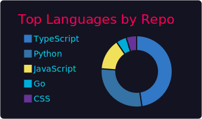

<div align="center">

<!-- ░░░ HEADER ░░░ -->


<!-- ░░░ TYPING SVG ░░░ -->
<a href="https://git.io/typing-svg">
  
</a>

<br/><br/>

<!-- ░░░ SOCIALS ░░░ -->
<a href="https://github.com/NeerajCodz"></a>&nbsp;
<a href="https://www.linkedin.com/in/neeraj-sathish-kumar"></a>&nbsp;
<a href="https://twitter.com/NeerajCodz"></a>&nbsp;
<a href="https://instagram.com/NeerajCodz"></a>&nbsp;
<a href="mailto:neerajcodz@gmail.com"></a>

<br/><br/>

<!-- ░░░ META ░░░ -->
&nbsp;


</div>

---

## 🧠 Who I Am

```yaml
name:     Neeraj Sathish Kumar
handle:   @NeerajCodz
domains:
  - 🌐 Web App Development   → Full-Stack · Next.js · React · NestJS · FastAPI
  - 🔐 Cybersecurity         → Encryption / Decryption · Secure Systems
  - 📱 App Development        → Android · Flutter · Firebase
  - 🤖 AI / ML               → LLMs · LangChain · LlamaIndex · GenAI · Agents
open_to:  [ Collaborations, Open Source, Internships ]
```

---

## ⚡ The Stack

<div align="center">

**Languages**

&nbsp;&nbsp;&nbsp;&nbsp;&nbsp;&nbsp;

**Frameworks & Runtimes**

&nbsp;&nbsp;&nbsp;&nbsp;&nbsp;

**Cloud, DB & Tooling**

&nbsp;&nbsp;&nbsp;&nbsp;&nbsp;&nbsp;

**Design**

&nbsp;

</div>

---

## 📊 GitHub Stats


<div align="center">




</div>

---

## 🔥 Streak

<div align="center">


</div>

---

## 📈 Contribution Graph

<div align="center">


</div>

---

## 🐍 Contribution Snake

<div align="center">

<picture>
  <source media="(prefers-color-scheme: dark)" srcset="https://raw.githubusercontent.com/NeerajCodz/NeerajCodz/output/github-snake-dark.svg" />
  <source media="(prefers-color-scheme: light)" srcset="https://raw.githubusercontent.com/NeerajCodz/NeerajCodz/output/github-snake.svg" />
  
</picture>

</div>

---

## 🏆 Trophies

<div align="center">


</div>

---

## 💬 Quote of the Day

> Auto-refreshed daily via [`quote.yml`](./.github/workflows/quote.yml) — random CS quote every 24h.

<!-- QUOTE:START -->
<!-- QUOTE:END -->

---

## ♟️ Play Chess With Me

> **Anyone** can play! Click a move below — it opens a pre-filled Issue. Once submitted, a GitHub Action updates the board automatically. Powered by [`chess.yml`](./.github/workflows/chess.yml).

<!-- BEGIN CHESS BOARD -->

> ♟️ Run [`chess.yml`](./.github/workflows/chess.yml) once to initialize the board. Then anyone can make a move via Issues!

<!-- END CHESS BOARD -->

**▶ It's White's turn — [Make a move!](../../issues/new?title=Chess%3A+Move&body=Move+notation%3A+%5Benter+algebraic+move%2C+e.g.+e2e4%5D)**

---

<div align="center">


**Let's build something great — find me anywhere @NeerajCodz 🚀**

</div>
