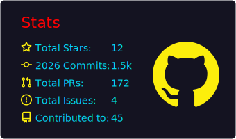
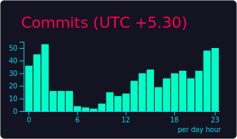
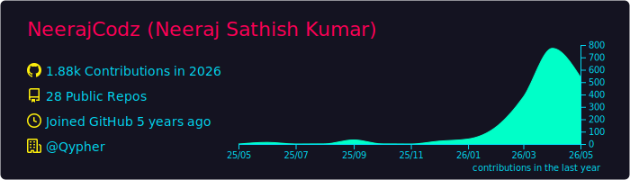
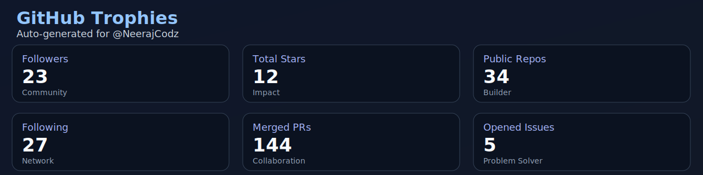

<div align="center">




<br/>

<a href="https://github.com/NeerajCodz"></a>
<a href="https://www.linkedin.com/in/neeraj-sathishkumar"></a>
<a href="https://twitter.com/NeerajCodz"></a>
<a href="https://instagram.com/NeerajCodz"></a>
<a href="mailto:neerajcodz@gmail.com"></a>

<br/>


</div>

## Live Dashboard

<div align="center">
  
  
</div>

<div align="center">
  
</div>

<div align="center">
  
</div>

<div align="center">
  
</div>

## About Me

```yaml
name: Neeraj Sathish Kumar
handle: NeerajCodz
focus:
  - Full-stack web applications
  - AI and ML product engineering
  - Cybersecurity and secure systems
  - Mobile app development
currently_building:
  - Developer-first automation tools
  - AI-enabled web platforms
open_to:
  - Collaboration
  - Open source
  - Internships
```

## ⚡ The Stack

<div align="center">

**Languages**

&nbsp;&nbsp;&nbsp;&nbsp;&nbsp;&nbsp;

**Frameworks & Runtimes**

&nbsp;&nbsp;&nbsp;&nbsp;&nbsp;

**Cloud, DB & Tooling**

&nbsp;&nbsp;&nbsp;&nbsp;&nbsp;&nbsp;

**Design**

&nbsp;

</div>

## Trophies and Highlights

<div align="center">
  
</div>

<div align="center">
  
  
</div>

## Contribution Snake

<div align="center">

<picture>
  <source media="(prefers-color-scheme: dark)" srcset="./profile/snake-dark.svg" />
  <source media="(prefers-color-scheme: light)" srcset="./profile/snake.svg" />
  
</picture>

</div>

## Quote of the Day

<!-- QUOTE:START -->
> "If you think good architecture is expensive, try bad architecture."
>
> - **Brian Foote** | March 25, 2026

<!-- QUOTE:END -->

<div align="center">



</div>

